# Proje1 tanıtımı
<!-- README.md dosyasının içeriği -->

## anamenu
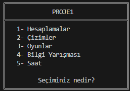
 
Ana menüde projemin içinde geçen konular yer alıyor.
 
###Birinci konu olan hesaplamaların menüsü bu şekilde:
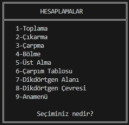
 
Hesaplamalar menümün içinde ilk olarak toplama var.
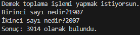
 
Ardından çıkarma işlemi geliyor.
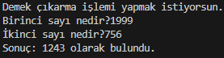
 
3.sırada çarpma işlemi var.
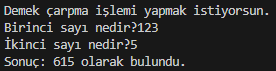
 
4.sırada bölme işlemi var.
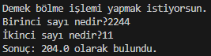
 
5.sırada üst alma işlemi var.
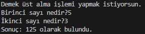
 
6.sırada çarpım tablosu var.
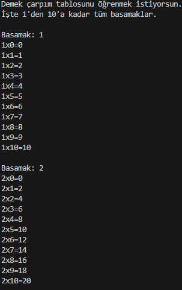
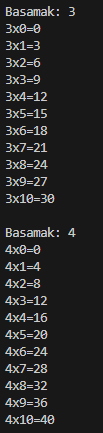
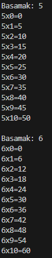
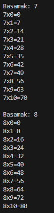
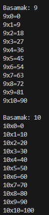
 

###2.konu çizimler ve anamenüsü bu şekilde.
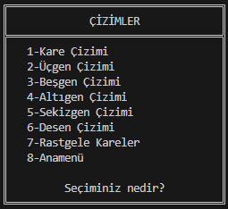
 
1.sırada kare çizimi var.
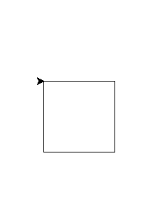
 
2.sırada üçgen çizimi var.

 
3.sırada beşgen çizimi var.
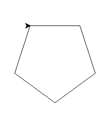
 
4.sırada altıgen çizimi var.
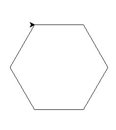
 
5.sırada sekizgen çizimi var.
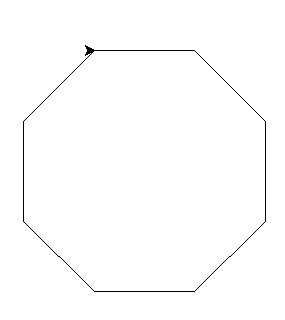
 
6.sırada desen çizimi var.
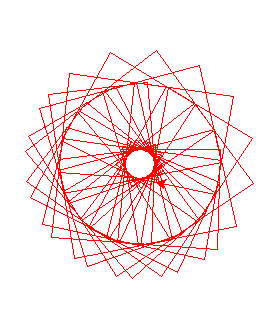
 
7.sırada rastgele kare çizimi var.
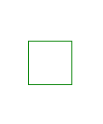
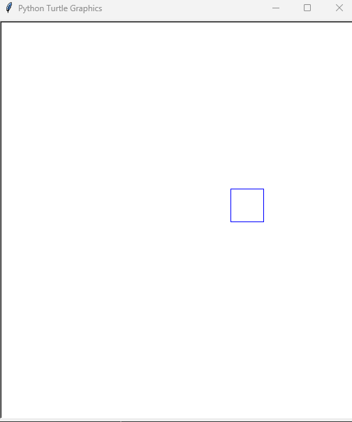

 

###3.konu oyunar ve anamenüsü bu şekilde.
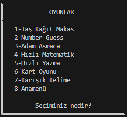
 
1.oyunumuz Taş Kağıt Makas.
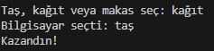
 
2.oyunumuz Sayı Tahmini.
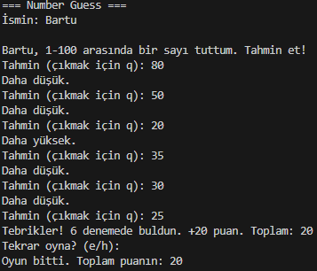
 
3.oyunumuz Adam Asmaca.

 
4.oyunumuz Hızlı Matematik.
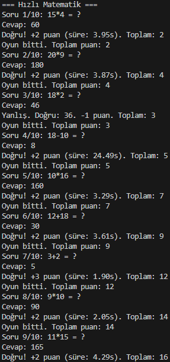
 
5.oyunumuz Hızlı Yazma.
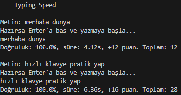
 
6.oyunumuz Kart Oyunu.
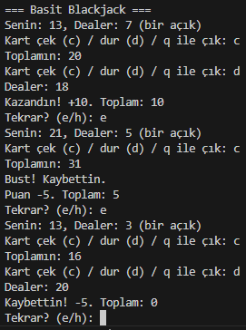
 
7.oyunumuz Karışık Harflerden Kelime Bulma.
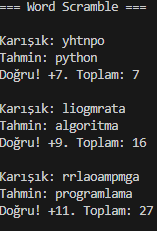
 

###4.konu olarak bilgi yarışması var.
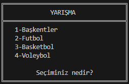
 
1.yarışmamız Başkentler ile alakalı.
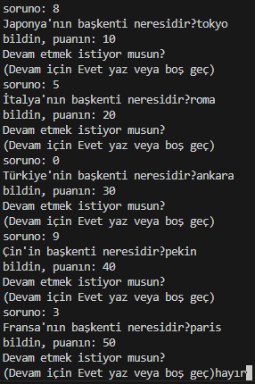
 
2.yarışmamız Futbol ile alakalı.
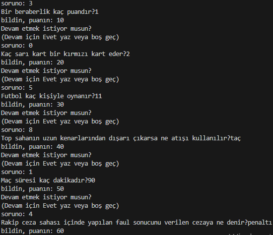
 
3.yarışmamız Basketbol ile alakalı.
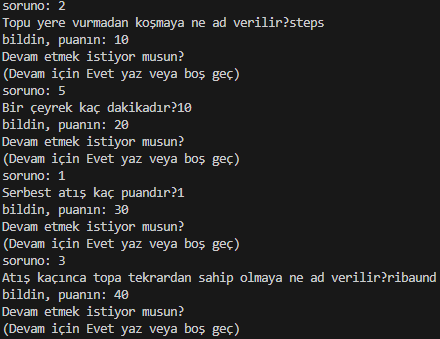
 
4.yarışmamız Voleybol ile alakalı.
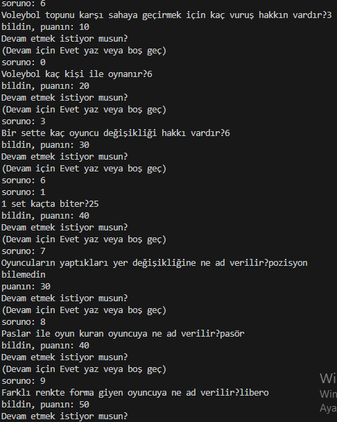
 

###Ve son konumuz olan saat ve tarih kısmına geldik.
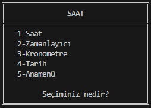
 
1.sırada canlı saat var.
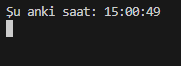
 
2.sırada zamanlayıcı var.
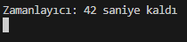
 
3.sırada kronometre var.
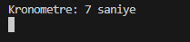
 
4.sırada tarih var.
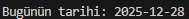
 

 
İşte bu benim 1.projem.

